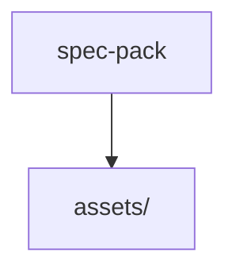

# 📚 agentic-os Documentation

Welcome to the complete documentation for this repository. This documentation is automatically generated and maintained by Woden Docbot.

   

## 🔗 Quick Links

[📂 spec-pack](./spec-pack/README.md)

---

> A focused repository subtree that stores and prepares media and build assets for the spec-pack remixathon deliverable.

## 📖 Overview

agentic-os' spec-pack area is a narrowly scoped container for the assets and build resources used to produce the spec-pack remixathon asset pack. It exists to centralize media files, build artifacts, and the scripts/recipes that transform and package those assets into deliverables for the remixathon. The intent is to isolate packaging and media-processing concerns so contributors can find and modify the material used to produce the spec-pack without sifting through unrelated code.

The repository structure is deliberate and simple: the spec-pack root is an organizational boundary and index that points to the real content under assets/. The assets/ subtree holds the concrete build and media-processing assets — including scripts and recipes for preparing media, build assets used in packaging, and any media-processing tooling or resources required for remixathon-specific builds. Developers working on packaging, media processing, or remixathon builds should look under assets/ for the actionable scripts and media; the spec-pack root indicates where those resources live and how they are grouped. The architectural approach is minimal and file-oriented: an asset repository boundary that groups scripts, recipes, media-processing resources, and build assets to support reproducible packaging workflows.

### 🧩 Key Components

| Component | Purpose | Technologies |
| --- | --- | --- |
| **spec-pack** | Logical root and organizational boundary that points developers to the spec-pack's asset collection and build preparation resources. | `scripts`, `recipes`, `build assets` |
| **assets/** | Primary content holder containing the build and media-processing assets, grouping scripts and recipes used to produce the remixathon asset pack deliverables. | `media-processing`, `scripts`, `recipes` |

**Component Architecture:**

### 🏗️ Architecture

A simple, file-centric asset repository: spec-pack is a logical root that delegates to an assets/ subtree which contains scripts, recipes, and media-processing/build assets used for preparing deliverables.

### 💡 Use Cases

- ✦ Packaging and preparing the spec-pack remixathon asset pack
- ✦ Media processing and asset transformation using the included scripts and recipes
- ✦ Providing a clear location for contributors to find and modify build and media assets for remixathon-specific builds

### 🔧 Technologies

   

---

## 📑 Documentation Sections

### [spec-pack](./spec-pack/README.md)
Holds media and build assets used by the spec-pack, primarily grouping scripts and recipes for the remixathon asset pack.

This directory is the container for the spec-pack's asset-related resources.

---

## 📊 Documentation Statistics

- **Files Documented**: 3
- **Directories**: 5
- **Coverage**: 100%
- **Last Updated**: 2026-05-02

---

## 🧭 How to Navigate

> ℹ️ **INFO**
> Each directory has its own README.md with detailed information about that section. Use the breadcrumb navigation at the top of each page to navigate back to parent directories.

### Navigation Features

- **Breadcrumbs** - At the top of each page, showing your current location
- **Directory READMEs** - Each folder has a comprehensive overview
- **File Documentation** - Click through to individual file documentation
- **Search** - Use GitHub's search or your IDE's search functionality

---

## 🤖 About Woden DocBot

This documentation is automatically generated and kept up-to-date by Woden DocBot, an AI-powered documentation assistant. DocBot analyzes code on every pull request and updates documentation to reflect changes.

### Features

- **Automatic Updates** - Documentation updates on every PR
- **Comprehensive Coverage** - Files, functions, classes, and directories
- **Smart Navigation** - Breadcrumbs, related files, and parent links
- **AI-Powered** - Uses Azure GPT models for intelligent documentation generation

---

*Generated by Woden DocBot for agentic-os*