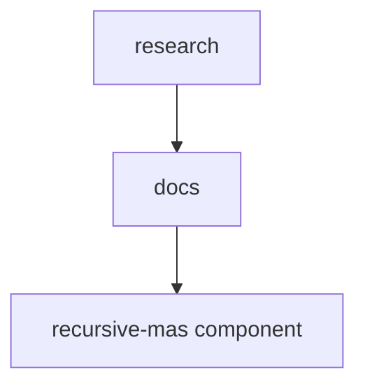

# 📚 agentic-os Documentation

Welcome to the complete documentation for this repository. This documentation is automatically generated and maintained by Woden Docbot.

   

## 🔗 Quick Links

[📂 research](./research/README.md)

---

> A dedicated research and documentation container for the recursive-mas component

## 📖 Overview

agentic-os provides a focused, repository-level area for research materials related to the recursive-mas component. It exists to keep reference implementations, verification artifacts, and research documentation organized and separate from the main implementation code. The repository's research directory intentionally contains no implementation files at its root; instead it acts as a namespace that signals where research artifacts live.

The primary content holder is research/docs/, which contains the reference implementations, verification tests, and supporting documentation for the recursive-mas work. This layout enforces a documentation-first organizational approach: the research/ directory names the area of inquiry and research/docs/ holds the concrete artifacts. The structure helps contributors and reviewers find verification artifacts and reference implementations without mixing research materials into the main codebase.

### 🧩 Key Components

| Component | Purpose | Technologies |
| --- | --- | --- |
| **research** | Top-level namespace and organizational container for research-focused documentation, reference implementations, and verification artifacts for the recursive-mas component. The root is intentionally empty to separate research artifacts from main code. | N/A |
| **docs** | Subdirectory under research/ that holds the actual research and documentation materials: reference implementations, verification artifacts, and explanatory documents for the recursive-mas component. | N/A |
| **recursive-mas component** | The focal research subject represented by materials in research/docs/ — reference implementations and verification artifacts are organized here to support reproducibility and review of recursive-mas research. | N/A |

**Component Architecture:**

### 🏗️ Architecture

Repository-level documentation namespace: an explicit separation between research materials (research/docs/) and the main codebase. The root research/ is empty to enforce organizational separation and clarity.

### 💡 Use Cases

- ✦ Centralized hosting of research documentation and reference implementations for the recursive-mas component
- ✦ Storing and organizing verification artifacts and tests that support reproducibility and review
- ✦ Signaling and enforcing separation between research artifacts and the main implementation code to aid contributors and reviewers

---

## 📑 Documentation Sections

### [research](./research/README.md)
Container for research-focused documentation, reference implementations, and verification artifacts related to the recursive-mas component; organizes research materials under a dedicated subdirectory.

This directory is a top-level research and documentation container that does not contain any implementation files at its root.

---

## 📊 Documentation Statistics

- **Files Documented**: 2
- **Directories**: 5
- **Coverage**: 100%
- **Last Updated**: 2026-05-02

---

## 🧭 How to Navigate

> ℹ️ **INFO**
> Each directory has its own README.md with detailed information about that section. Use the breadcrumb navigation at the top of each page to navigate back to parent directories.

### Navigation Features

- **Breadcrumbs** - At the top of each page, showing your current location
- **Directory READMEs** - Each folder has a comprehensive overview
- **File Documentation** - Click through to individual file documentation
- **Search** - Use GitHub's search or your IDE's search functionality

---

## 🤖 About Woden DocBot

This documentation is automatically generated and kept up-to-date by Woden DocBot, an AI-powered documentation assistant. DocBot analyzes code on every pull request and updates documentation to reflect changes.

### Features

- **Automatic Updates** - Documentation updates on every PR
- **Comprehensive Coverage** - Files, functions, classes, and directories
- **Smart Navigation** - Breadcrumbs, related files, and parent links
- **AI-Powered** - Uses Azure GPT models for intelligent documentation generation

---

*Generated by Woden DocBot for agentic-os*