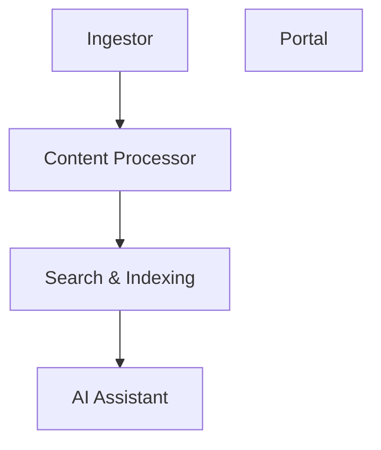

# 📚 agentic-os Documentation

Welcome to the complete documentation for this repository. This documentation is automatically generated and maintained by Woden Docbot.

   

## 🔗 Quick Links

[📂 services](./services/README.md)
[📋 Dependencies](./DEPENDENCIES.md)

---

> DocHub automatically ingests, indexes, and exposes enterprise documents through an intelligent search and conversational assistant to accelerate knowledge discovery.

## 📖 Overview

DocHub is a document intelligence platform designed to consolidate dispersed enterprise content, enrich it with metadata, and make it instantly searchable. It connects to repositories, extracts text and structured data, and builds a unified index so teams can find authoritative answers without toggling between tools.

The platform also provides an AI-driven conversational assistant that interprets user queries, cites source documents, and surfaces relevant passages. DocHub emphasizes data provenance, scalable indexing, and extensible connectors so organizations can onboard new content sources rapidly while maintaining governance and auditability.

### 🧩 Key Components

| Component | Purpose | Technologies |
| --- | --- | --- |
| **Ingestor** | Connects to source systems (file shares, CMS, cloud storage, databases), extracts documents and metadata, normalizes formats, and streams content into the processing pipeline. | `Python`, `Apache Airflow`, `Azure Blob Storage` |
| **Content Processor** | Performs OCR, text extraction, metadata enrichment, language detection, and chunking for downstream indexing and embeddings. | `Tika`, `Tesseract`, `spaCy` |
| **Search & Indexing** | Builds and serves the searchable index, manages ranking and retrieval, and supports semantic search over vector embeddings and traditional inverted indexes. | `Elasticsearch`, `FAISS`, `PostgreSQL` |
| **AI Assistant** | Handles conversational queries, performs retrieval-augmented generation (RAG) with source citations, and formats responses for the UI and APIs. | `OpenAI API`, `LangChain`, `Python` |
| **Portal** | User-facing web application for search, browsing, and conversational interactions, plus admin interfaces for connectors, policies, and audit logs. | `React`, `TypeScript`, `Kubernetes` |

**Component Architecture:**

### 🏗️ Architecture

DocHub uses a modular, serverless-friendly pipeline: connectors feed an enrichment layer that outputs vector and keyword indices. A retrieval layer serves both the search UI and a conversational API, while governance and storage are handled by cloud storage and a relational store for metadata.

### 💡 Use Cases

- ✦ Enterprise knowledge search for support and engineering teams
- ✦ On-demand document Q&A and compliance verification
- ✦ Automated content aggregation and metadata tagging
- ✦ Context-aware assistant for onboarding and training

### 🔧 Technologies

**Languages:** 

**Frameworks:** 

**Cloud:**  

**Databases:** 
    

### 📦 External Dependencies

The following external packages are used across the project:

- `AWS S3`
- `Apache Tika`
- `Azure Blob Storage`
- `Docker`
- `Elasticsearch`
- `FAISS`
- `Kubernetes`
- `OpenAI API`
- `PostgreSQL`
- `Redis`
- `Tesseract OCR`

---

## 📑 Documentation Sections

### [services](./services/README.md)
Top-level collection of service implementations and service-specific test suites that provide backend application components for the overall project.

The services directory is the container for service implementations and their tests.

---

## 📊 Documentation Statistics

- **Files Documented**: 13
- **Directories**: 8
- **Coverage**: 100%
- **Last Updated**: 2026-06-13

---

## 🧭 How to Navigate

> ℹ️ **INFO**
> Each directory has its own README.md with detailed information about that section. Use the breadcrumb navigation at the top of each page to navigate back to parent directories.

### Navigation Features

- **Breadcrumbs** - At the top of each page, showing your current location
- **Directory READMEs** - Each folder has a comprehensive overview
- **File Documentation** - Click through to individual file documentation
- **Search** - Use GitHub's search or your IDE's search functionality

---

## 🤖 About Woden DocBot

This documentation is automatically generated and kept up-to-date by Woden DocBot, an AI-powered documentation assistant. DocBot analyzes code on every pull request and updates documentation to reflect changes.

### Features

- **Automatic Updates** - Documentation updates on every PR
- **Comprehensive Coverage** - Files, functions, classes, and directories
- **Smart Navigation** - Breadcrumbs, related files, and parent links
- **AI-Powered** - Uses Azure GPT models for intelligent documentation generation

---

*Generated by Woden DocBot for agentic-os*