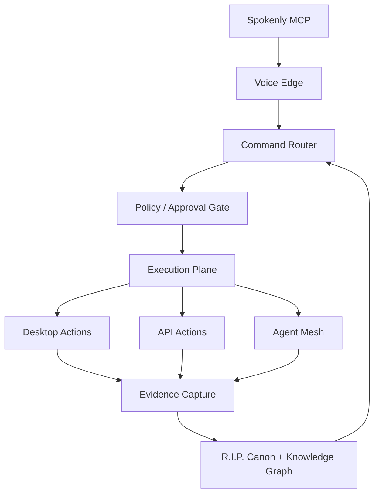

# Agentic OS Deployment Blueprint

## Objective
Deploy a unified voice-first, desktop-controlled, memory-backed, governance-gated agent operating system.

## Topology

## Deployment Stages

### Stage 0 — Foundation
- Create the repo layout
- Define secrets and access tokens
- Register core routes and services
- Establish the canonical memory layer

### Stage 1 — Voice and Command
- Connect Spokenly MCP as the clarification layer
- Wire Command Palette as the searchable command surface
- Add deterministic parsing in Voice Orion

### Stage 2 — Execution
- Add desktop actions for tmux, VS Code browser, SSH, and Mac automation
- Wire Zo API access and Google Direct OAuth where needed
- Implement approval-gated execution for risky actions

### Stage 3 — Swarm and Identity
- Bring in OpenClaw for orchestration
- Add peer coordination and tmux-based multi-terminal control
- Sync outcomes into R.I.P. and the Knowledge Graph

### Stage 4 — Packaging and UX
- Export reusable pieces with zopack
- Surface system health through glyphy pets
- Add CYOA and narrative overlays for operator-friendly exploration

## Operational Rules
- Voice questions are asked through MCP, not plain text, whenever clarification is needed.
- High-risk actions require approval.
- Every executed action must produce evidence.
- Canonical truth lives in R.I.P.; operational context lives in the Knowledge Graph.
- Packaging must be reproducible via zopack.

## Success Criteria
- Voice input can drive the system end-to-end.
- The router can classify and dispatch intents reliably.
- Execution actions are gated and auditable.
- Memory updates are deterministic and reviewable.
- The stack can be exported and redeployed as a bundle.
